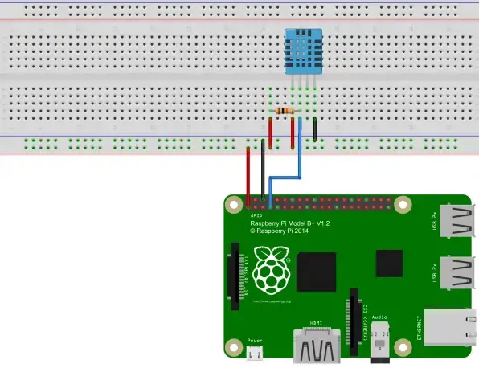

# DHT22_Temperature
Application for reading temperature and humidity values from DHT22 sensor connected to Raspberry PI and uploading the values to a AWS DynamoDB table.

## Install Adafruit module
Install the Adafruit module and Python required modules
```sh
sudo apt install python3-dev python3-pip
sudo python3 -m pip install --upgrade pip setuptools wheel
sudo pip3 install Adafruit_DHT
```

# Hardware
The left pin of the sensor is connected to 3V3 of Pi (pin1), the second sensor pin via a pull-up resistor (10kΩ) with a free GPIO of the raspberry (GPIO4, pin7) and the right senior pin comes at GND (Pin6) from the Pi. The second pin from the right of the sensor remains free.



## Install AWS CLI v2
Install AWS CLI v2 builind it from scratch in order to be compatible with Raspberry PI architecture (armhf).

```sh
git clone https://github.com/aws/aws-cli.git
cd aws-cli && git checkout v2
pip3 install -r requirements.txt
pip3 install .
echo 'export PATH=$PATH:/$HOME/.local/bin/aws' >> $HOME/.bashrc
sudo reboot
```

## Install boto3
Install AWS boto3 module.

```sh
pip3 install boto3
```

## Configure AWS Credentials
Configure AWS credentials providing IAM user access key and secret access key.

```sh
aws configure
```

## Cron Job
Configure a Cron Job in order to execute the script every hour at 0,15,30,45 minutes.
Open the Cron editor:
```sh
crontab -e
```

Add the following line
```
0,15,30,45 * * * * /usr/bin/python3 /home/marco/Documents/DHT22/DHT22_read.py
```

## Reference
https://pimylifeup.com/raspberry-pi-humidity-sensor-dht22/
https://tutorials-raspberrypi.com/raspberry-pi-measure-humidity-temperature-dht11-dht22